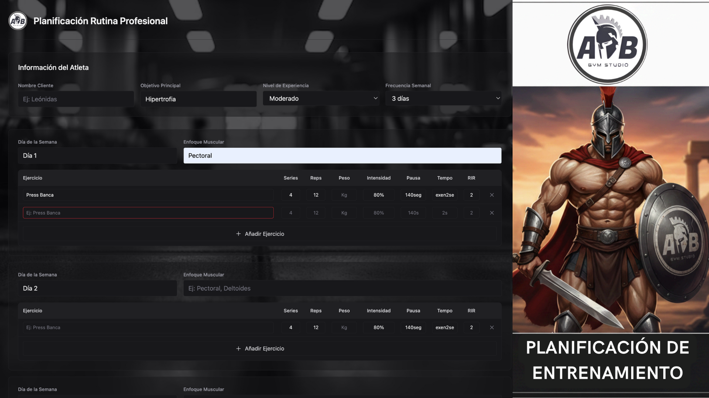

# Automatización Creación PLanificación Rutina GYM 

Desarrollo de una solución integral para la digitalización de servicios de entrenamiento, optimizando el flujo de trabajo administrativo mediante la automatización de la creación y gestión de rutinas personalizadas.

Implementación de una API de alto rendimiento con Python y FastAPI sobre Uvicorn, integrando un motor de generación dinámica de documentos PDF con Reportlab para la entrega inmediata de planes técnicos.
0EqHX1v2n9gIPOgA

